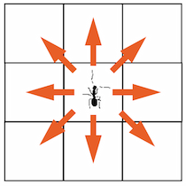
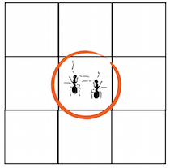

#Ant Colony  Kata

The goal is to implement a colony of ants gathering food for their tribe. See it in action [here](http://sebastianbenz.github.com/ant-colony) (click to add food sources).

##Rules

1. If you don't know where food is, try to find some.
2. If you see another ants, ask if they know where food is. If they know, head toward the food. If not, continue searching.
3. If you find food, take it back to the home, and return to the place where you found food. 
4. If you don't find any food where you thought it was supposed to be, start searching again.

### Moving

Ants can move in all directions.

### Talking

Ants on the same field can talk.

